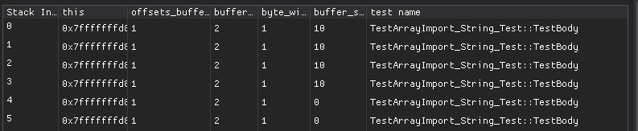
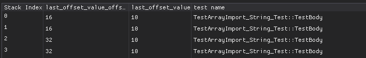

# Extending GDB to Visualize Call Hierarchies

When you're becoming familiar with a new codebase, stepping through the tests with a debugger can be a great way to find your footing. Often, the tests can show you how the API of the codebase can be used and give you a general sense of how the various modules interact. Find a function you're interested in, add a breakpoint, and run a test. Then, when the execution breaks, poke around the code, look at your locals, and examine the stack trace.

Today, we're going to use GDB's Python API to extend our breakpoints further. First, we'll add breakpoints that automatically print the call stack and locals (most debuggers can already do something similar to this). Then, we'll start saving and merging our call stacks to create some visualizations of all the call hierarchies that run in a particular test. Finally, we'll add a small GUI to introduce some interactivity and allow us to inspect particular call hierarchies that hit a breakpoint during a test. We'll end up with something that looks like this:


## The Code we'll be visualising

We'll using the Apache Arrow source code <LINK> to test our breakpoints. Specifically we'll be looking at the `ImportStringValuesBuffer` function in `cpp/src/arrow/bridge.cc`.

Looking at `bridge.h` we can see a bunch of functions that handle importing/exporting of Arrow data from the C data interface to C++ objects. Our function lives in an `ArrayImporter` type which lives in an anonymous namespace in `bridge.cc`. Back to `bridge.h` we can see two functions related to importing Arrays:

```C++
Result<std::shared_ptr<Array>> ImportArray(struct ArrowArray* array,
                                           std::shared_ptr<DataType> type);

Result<std::shared_ptr<Array>> ImportArray(struct ArrowArray* array,
                                           struct ArrowSchema* type);
```

So we can make the assumption now that those functions will at some point use `ArrayImporter::ImportStringValuesBuffer` to turn C data into a C++ object.

The `arrow-c-bridge-test` calls this function a number of times, so we'll be using that test to try out our breakpoints.

That's all we need to know for now, let's do some exploring.

## GDB

Lets recap some basics of running GDB and using the Python API:

```bash
# Run start gdb loading the binary you want to debug
gdb <path to your binary>

# Inside gdb

# Run the program
(gdb) run
# or
(gdb) r

# set a breakpiont
(gdb) breakpoint <file>:<line_number_to_break>
#e.g. put a breakpoint in line 14 of main.cpp
(gdb) breakpoint main.cpp:14
# or
(gdb) b main.cpp:14


# After a breakpoint has been hit
# Continue exection
(gdb) continue
# or
(gdb) c

# Step through a single line of code, over function calls
(gdb) next
# or
(gdb) n

# Step through a single line of code, into function calls
(gdb) stepi
# or
(gdb) si

# Print information about the current local variables in scope
(gdb) info locals

# Source a python file
(gdb) source <path to file>

# Run a python command
(gdb) python <command>

# Start the python interpreter
(gdb) pi

# In the python interpreter
>>> print("Hello World!")
```

## Extending gdb.breakpoint

### Basic Breakpoint

To create our own Python breakpoint that functions like a regular breakpoint, we can use the following Python code:

```python
import gdb

class BasicBreakpoint(gdb.Breakpoint):
    def stop(self):
        return True

```

In this example, we inherit from `gdb.Breakpoint` and implement the `stop` method. The boolean value returned from this method tells GDB whether to break and wait for user input or to continue execution. The return value of `stop` is key to of a lot of the breakpoints we'll be making. It allows us to make conditional breakpoints, but since we're in python we're also able write more complex logic and access the entire Python ecosystem as well.

Let's start GDB, set a breakpoint, and run our test:

```bash
user@computer:~$ gdb ./test

(gdb) source ./basic.py
(gdb) pi
>>> BasicBreakpoint("bridge.cc:1883")
>>> exit()
(gdb) run
```

At this point, GDB should break at the specified location, behaving just as it does when a regular breakpoint is set.

### Printing the locals

Now that we have our breakpoint stopping at the right place, we'll do something more interesting. We can access the Python objects that represent the current locals of the function where we break. By iterating through them, we'll print the values of those locals every time we hit a breakpoint.

Let's add the necessary code to the stop method:

```python
import gdb

class PrintLocalsBreakpoint(gdb.Breakpoint):
    def stop(self):
        frame = gdb.selected_frame()
        for symbol in frame.block():
            print(f"{str(symbol.name)}: {symbol.value(frame).format_string()}")
        return True
```

```bash
user@computer:~$ ~/arrow/cpp/build-debug/debug$ gdb arrow-c-bridge-test
(gdb) source ./print_locals.py
(gdb) python PrintLocalsBreakpoint("bridge.cc:1883")
(gdb) run

# program output

this: 0x7fffffffd8b0
offsets_buffer_id: 1
buffer_id: 2
byte_width: 1
buffer_size: 10

```

### Printing the stack

We can use a similar method to print the stack trace of the function where we break.

We'll add an extra function called `tidy(function_name)` to remove common namespaces, like `arrow::` and `std::`, shorten any overly long function names and remove the parameters from the function signature to make the stack trace a little more readable.

**_NOTE:_** _I've chosen the what to tidy based on running these breakpoints and choosing what I think can be left out. This will need to be adjusted for other functions/codebases_.

Here's the implementation:

```python
import re
import gdb


def tidy(function_name):
    function_name = str(function_name)
    function_name = function_name.replace("arrow::", "")
    function_name = function_name.replace("engine::", "")
    function_name = function_name.replace("std::", "")
    function_name = function_name.replace("(anonymous namespace)::", "")
    if function_name.startswith("CheckNotYetImplementedTestCase"):
        function_name = "CheckNotYetImplementedTestCase"

    # Remove
    function_name = "".join(re.split("\(|\)", function_name)[::2])

    return function_name


class StackTraceBreakpoint(gdb.Breakpoint):
    def stop(self):
        frame = gdb.selected_frame()
        while frame:
            print(tidy(frame.function().name))

            frame = frame.older()

        return True

```

Now, when we hit our breakpoint, the call stack is printed with the function names tidied for readability.

```bash
user@computer:~/arrow/cpp/build-debug/debug$ gdb arrow-c-bridge-test
(gdb) source ./print_locals.py
(gdb) python StackTraceBreakpoint("bridge.cc:1883")
(gdb) run

# program output

ArrayImporter::ImportStringValuesBuffer<int>
ArrayImporter::ImportStringLike<StringType>
ArrayImporter::Visit
VisitTypeInline<ArrayImporter>
ArrayImporter::DoImport
ArrayImporter::Import
ImportArray
TestArrayImport::CheckImport
TestArrayImport_String_Test::TestBody
testing::internal::HandleSehExceptionsInMethodIfSupported<testing::Test, void>testing::Test::*
testing::internal::HandleExceptionsInMethodIfSupported<testing::Test, void>testing::Test::*
testing::Test::Run
testing::TestInfo::Run
testing::TestSuite::Run
testing::internal::UnitTestImpl::RunAllTests
testing::internal::HandleSehExceptionsInMethodIfSupported<testing::internal::UnitTestImpl, bool>testing::internal::UnitTestImpl::*
testing::internal::HandleExceptionsInMethodIfSupported<testing::internal::UnitTestImpl, bool>testing::internal::UnitTestImpl::*
testing::UnitTest::Run
RUN_ALL_TESTS
main

```

### Visualising the call stack

When we run a test, we generate a number of call stacks representing all the different ways the code path reaches our function for that test. Take the simple program below:

```python
def c():
    pass

def b():
    c()

def a():
    c()

if __name__ == "__main__":
    a()
    b()
    c()
```

If we're interested in all the ways the program can reach `c`, we can draw the following graph.


Let's apply this concept to the breakpoint we just created. We can create a similar graph from the call stacks we've collected.

```python
import graphviz
import re
import gdb

def tidy(function_name):
# ...

class StackTraceBreakpoint(gdb.Breakpoint):
    def __init__(self, breakpoint_location):
        super().__init__(breakpoint_location)
        self.name = "arrow-c-bridge-test-graph"
        self.function_names = set()
        self.stacks = []

    def stop(self):
        frame = gdb.selected_frame()
        stack = []
        while frame:
            tidied_function_name = tidy(frame.function().name)
            stack.append(tidied_function_name)
            self.function_names.add(tidied_function_name)

            frame = frame.older()

        self.stacks.append(stack)

        return False
```

We've added an `__init___` function which passes `breakpoint_location` on to the parent.

Then we set three member variables:

- name: We'll use this later to name our visualization.
- function_names: We use a set here since multiple call stacks will have repeated function names, but we only need the unique names to represent the nodes in our graph.
- stacks: A list of lists of function names (a list of our call stacks).

By returning `False` in `stop`, we tell GDB to not break each time the breakpoint is hit. Instead, our stop code is run and the program is continued.

We also want to create and view our graph using the Python Graphviz library. The `function_names` will be the nodes of our graph, and we can get the edges by iterating through our stacks and creating tuples from pairs of successive elements.

We'll create `create_and_view_graph` as a member function:

```python

class StackTraceBreakpoint(gdb.Breakpoint):
    def __init__(self, breakpoint_location):
        #...

    def stop(self):
        #...

    def create_and_view_graph(self):
        self.dot = graphviz.Digraph(self.name)
        self.function_names_list = list(self.function_names)

        for index, function_name in enumerate(self.function_names_list):
            self.dot.node(str(index), str(function_name))

        self.edges = set()
        for stack in self.stacks:
            for i in range(len(stack) - 1):
                from_node = self.function_names_list.index(stack[i + 1])
                to_node = self.function_names_list.index(stack[i])
                self.edges.add((str(from_node), str(to_node)))

        for from_node, to_node in self.edges:
            self.dot.edge(str(from_node), str(to_node))

        self.dot.format = "svg"
        self.dot.view()

```

If we save our breakpoint to a variable, we can use the Python interpreter to run `create_and_view_graph` and see our graph after running the program:

```bash
user@computer:~/arrow/cpp/build-debug/debug$ gdb arrow-c-bridge-test
(gdb) source ./view_call_graph.py
(gdb) python b = StackTraceBreakpoint("bridge.cc:1883")
No source file named bridge.cc.
Breakpoint 1 (bridge.cc:1883) pending.

#... program output

(gdb) python b.create_and_view_graph()
```

And we're presented with a visualization of all the ways that arrow-c-bridge-test reaches our function.


It would be a bit more handy if we could have `create_and_view_graph` called automatically when the program ends. What we need is a way to detect when the program finishes and run some code then. Everything is a nail when all you've got is a hammer, so let's create another type of breakpoint to do just that.

```python

class ExitBreakpoint(gdb.Breakpoint):
    def __init__(self, do_on_exit):
        super().__init__("exit")
        self.do_on_exit = do_on_exit

    def stop(self):
        self.do_on_exit()
        return False

def stack_to_edges(stack, function_names_list):
    # ...

class StackTraceBreakpoint(gdb.Breakpoint):
    def __init__(self, breakpoint_location):
        #...
        ExitBreakpoint(self.create_and_view_graph)

    def stop(self):
        #...

    def create_and_view_graph(self):
        #...
```

The `ExitBreakpoint` class takes a `do_on_exit` function and saves it to a member variable so we can call it later. It then uses the `super().__init__` function to set a breakpoint on the exit of the program. Finally, we provide an implementation for `stop` which calls `do_on_exit` when the breakpoint is hit, which is when the program exits, exactly what we want!

By creating the `ExitBreakpoint` in the constructor of the `StackTraceBreakpoint` and passing it our `create_and_view_graph` function, we have our graph created for us when the program stops. We can now source/rerun our program, and we get the same graph we had before.

### Analyzing the Call Hierarchy Graph

Let's pan around this SVG and see what we can find out about `arrow-c-bridge-test` and how it eventually calls `ImportStringValueBuffer`.

#### Test Groups

We can quickly see the names of the tests that use our function and can notice some groups of tests that exhibit unique behavior:

- All of the `TestArrayImport*` tests call `TestArrayImport::CheckImport`.
- The `TestArrayImport_*Error` tests call a different check function in `TestArrayImport::CheckImportError`.
- The `TestArrayRoundTrip*` functions seem to be the last types of tests shown here and don't call `CheckImport`.

#### Function Calls

<IMPORT PICTURE>

- All of the code paths eventually lead to `ArrayImporter::Import`, which seems to be a recursive function because it has an arrow pointing to itself. However, we need to be cautious here because we removed all of the parameters from the function signature, so this might not be a recursive function at all. It could just be one function calling an overloaded function of the same name. Upon inspection of the code, we find that both of these possibilities are true.

- The `ArrayImporter::DoImport` function calls `ImportDict`, which calls `ImportChild`, which then calls `DoImport` again, forming a recursive loop. Earlier, we saw some tests mentioning importing dictionaries so this is the likely code path of those tests, although it's hard to tell with this image.

#### Visitor Pattern

Finally, right down at the bottom, we can see that this importer employs a visitor pattern with `ArrayImporter::Visit`, which eventually calls two template instantiations of our function of interest:

- `ImportStringValuesBuffer<int>`
- `ImportStringValuesBuffer<long>`

With just a quick look, we've been able to get a bit of understanding about how this function gets called from our test. I highly recommend looking at this image while finding the corresponding functions in the code. I find having two different representations of the code flow is great for forming an understanding in my head.

### Adding some interactivity

Let's combine the `PrintLocalsBreakpoint` with the `StackTraceBreakpoint` as well as a GUI table element to create an interactive call hierarchy explorer.

For each stack trace we save, we'll also save all the locals variable names and their values. Next, we'll use `dearpygui` to display these variables in a table. We'll add a callback to each row which we'll send to our graph code to re-render our call graph, but this time we'll give it the index of one of our stack traces which we'll use to highlight the call graph stack trace that we've selected.

#### Update `stop` and `create_and_view_graph`

First, we'll update our `stop` and `create_and_view_graph` functions to save the locals. We'll add a `selected_stack_index` so that we can highlight a selected stack's edges in the graph.

```python
# ...
import dearpygui.dearpygui as dpg


class ExitBreakpoint(gdb.Breakpoint):
#...


def tidy(function_name):
    #...

class StackTraceBreakpoint(gdb.Breakpoint):
    def __init__(self, breakpoint_location):
        # ...
        # We'll now save our locals as well
        self.stacks_and_locals = []
        ExitBreakpoint(self.on_exit)

    def stop(self):
        frame = gdb.selected_frame()

        # Get the locals names and values
        frame_locals = []
        for symbol in frame.block():
            frame_locals.append(
                {
                    "name": str(symbol.name),
                    "value": symbol.value(frame).format_string(),
                }
            )

        stack = []
        while frame:
            tidied_function_name = tidy(frame.function().name)
            stack.append(tidied_function_name)
            self.function_names.add(tidied_function_name)

            frame = frame.older()

        self.stacks_and_locals.append((stack, frame_locals))

        return False

    def stack_to_edges(self, stack):
        # ...

    def create_and_view_graph(self, selected_stack_index):
        # ...
        for stack_index, (stack, locals) in enumerate(self.stacks_and_locals):
            i_i_plus_1_merge = [(stack[i], stack[i + 1]) for i in range(len(stack) - 1)]
            for function_name, next_function_name in i_i_plus_1_merge:
                self.edges.add(
                    (
                        self.function_names_list.index(next_function_name),
                        self.function_names_list.index(function_name),
                        "red" if stack_index is selected_stack_index else "black",
                    )
                )

        for from_node, to_node, color in self.edges:
            self.dot.edge(str(from_node), str(to_node), color=color)

        self.dot.format = "svg"
        self.dot.view()

```

#### Add a Table

We'll add a function that creates a table. Each row will display the local variable names and values. We'll also display the test name which we can identify from the previous step is always the 12th to last function in each stack.

We also specify `on_row_select` to be our row selection callback. This function gets passed the row index that we've selected which we use to call `create_and_view_graph` with a highlighted stack.

```python
    def create_and_show_stack_table(self):
        dpg.create_context()

        def on_row_select(sender, app_data, user_data):
            row_selected_index = user_data
            self.create_and_view_graph(row_selected_index)

        with dpg.window(tag="Selectable Tables"):
            with dpg.table(tag="SelectRows", header_row=True):
                dpg.add_table_column(label="Size")

                # assume all locals have the same schema
                # add the columns
                first_locals = self.stacks_and_locals[0][1]
                for local in first_locals:
                    dpg.add_table_column(label=local["name"])

                dpg.add_table_column(label="test name")

                # add the data
                for index, (stack, locals) in enumerate(self.stacks_and_locals):
                    with dpg.table_row():
                        dpg.add_selectable(
                            label=f"{index}",
                            span_columns=True,
                            callback=on_row_select,
                            user_data=index,
                        )

                        for local in locals:
                            dpg.add_text(local["value"])

                        dpg.add_text(stack[-12])

        dpg.create_viewport(title="Locals", width=800, height=600)
        dpg.setup_dearpygui()
        dpg.show_viewport()
        dpg.start_dearpygui()
        dpg.destroy_context()

    def on_exit(self):
        self.create_and_view_graph(None)
        self.create_and_show_stack_table()
```

Now when we click on a stack, the graph is updated with the highlighted call hierarchy.

https://github.com/alanstoate/explore-with-gdb/graph.mp4

#### Exploring the locals

We can look through our locals and see how they change each time `ImportStringValuesBuffer` is called. We only get one local that changes here and thats `buffer_size`. Looking back at the code for this function we can see this is because we've put our breakpoint at the return function when a number of other locals have already been destructed.

```c++
1868 |  template <typename OffsetType>
1869 |  Status ImportStringValuesBuffer(int32_t offsets_buffer_id, int32_t buffer_id,
1870 |                                  int64_t byte_width = 1) {
1871 |    int64_t buffer_size = 0;
1872 |    if (c_struct_->length > 0) {
1873 |      int64_t last_offset_value_offset =
1874 |          (c_struct_->length + c_struct_->offset) * sizeof(OffsetType);
1875 |      OffsetType last_offset_value;
1876 |      RETURN_NOT_OK(MemoryManager::CopyBufferSliceToCPU(
1877 |          data_->buffers[offsets_buffer_id], last_offset_value_offset, sizeof(OffsetType),
1878 |          reinterpret_cast<uint8_t*>(&last_offset_value)));
1879 |      // Compute visible size of buffer
1880 |      buffer_size = byte_width * last_offset_value;
1881 |    } // <-- New Breakpoint
1882 |
1883 |    return ImportBuffer(buffer_id, buffer_size);  // <--- First Breakpoint
1884 |   }
```

Let's put our breakpoint at the end of the if statement and rerun our test to compare.

```bash
(gdb) source ./view_call_graph.py
(gdb) python b = StackTraceBreakpoint("bridge.cc:1880")
Breakpoint 1 (bridge.cc:1880) pending.

#... program output

(gdb) python b.create_and_view_graph()
```

Breakpoint at bridge.cc:1883



Breakpoint at bridge.cc:1880



There's only four stack traces available when the length of the data we're trying to import is greater than zero.

Let's go back to our test to try and see why:

```c++
TEST_F(TestArrayImport, String) {
  FillStringLike(4, 0, 0, string_buffers_no_nulls1);
  CheckImport(ArrayFromJSON(utf8(), R"(["foo", "", "bar", "quux"])"));
  FillStringLike(4, 0, 0, string_buffers_no_nulls1);
  CheckImport(ArrayFromJSON(binary(), R"(["foo", "", "bar", "quux"])"));
  FillStringLike(4, 0, 0, large_string_buffers_no_nulls1);
  CheckImport(ArrayFromJSON(large_utf8(), R"(["foo", "", "bar", "quux"])"));
  FillStringLike(4, 0, 0, large_string_buffers_no_nulls1);
  CheckImport(ArrayFromJSON(large_binary(), R"(["foo", "", "bar", "quux"])"));

  auto length = static_cast<int64_t>(std::size(binary_view_buffer1));
  FillStringViewLike(length, 0, 0, binary_view_buffers_no_nulls1, 2);
  CheckImport(MakeBinaryViewArrayWithMultipleDataBuffers());

  // Empty array with null data pointers
  FillStringLike(0, 0, 0, string_buffers_omitted);
  CheckImport(ArrayFromJSON(utf8(), "[]"));
  FillStringLike(0, 0, 0, large_string_buffers_omitted);
  CheckImport(ArrayFromJSON(large_binary(), "[]"));
}
```

We have two empty arrays being tested which explains why we have only four stack traces that break inside the if statement.
We also have four tests for arrays with a total of 10 characters which explains our four greater than zero length imports.
But there's another test that uses `FillStringViewLike` and `MakeBinaryViewArrayWithMultipleDataBuffers` which doesn't seem to have a break in `ImportStringValuesBuffer`. It could be worth exploring (at another time) why.

#### Exploring the stacks

Looking back the the `DoImport`, `ImportDict`, `ImportChild` loop, we can now click on any of the dictionary tests to confirm that they are using this loop (Makes sense that the ImportDictionary tests use the import dictionary loop). Additionally, we can see that the `Nested_DictionaryTest` is using the `ImportChild` methods as well as the loop (again, makes sense).

## Finishing Thoughts

We've covered a few different ways of extending breakpoints here which you can use in your own debugging. I hope you extend these further to help you quickly visualize the code you have for the problem you're facing. Maybe you want to:

- Make a conditional breakpoint that only saves a stack if a function exists up the call hierarchy
- Visualize you're locals or stacks differently with images or charts

Everything that's been explored could have been found by reading the code or by using regular debugging to step through the code. I find, however, that building these call hierarchies helps me to quickly gain a wider understanding of the code base and that having another representation of the code path really helps (it's also fun to make some pictures every now and then).

Thanks for reading!
